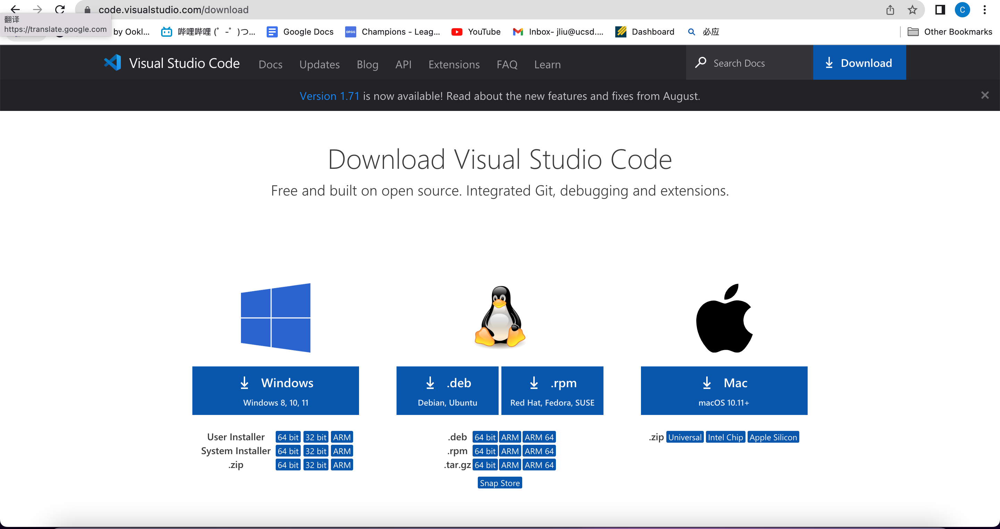
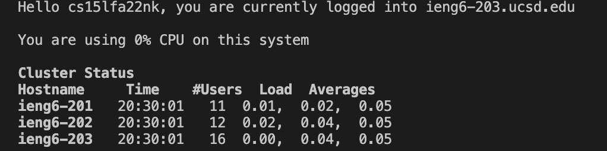
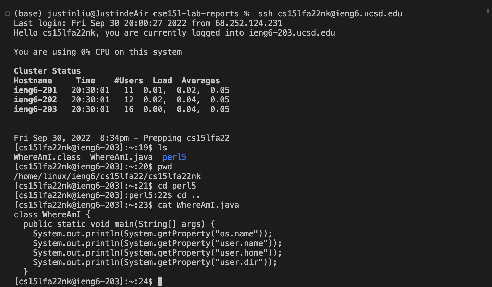
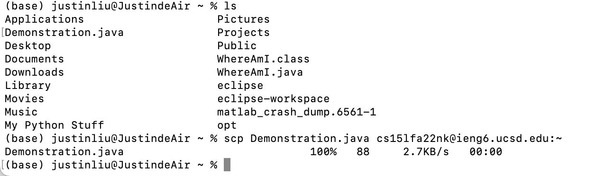
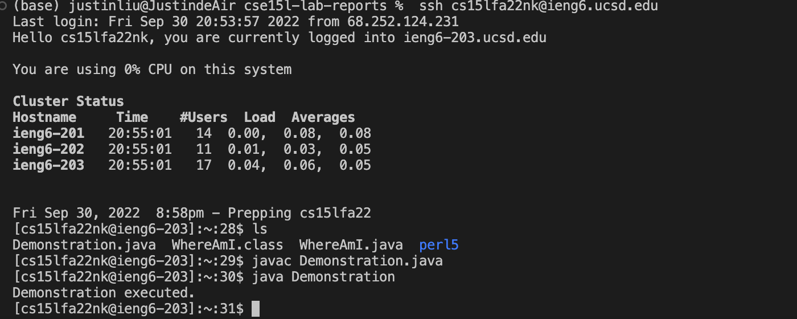
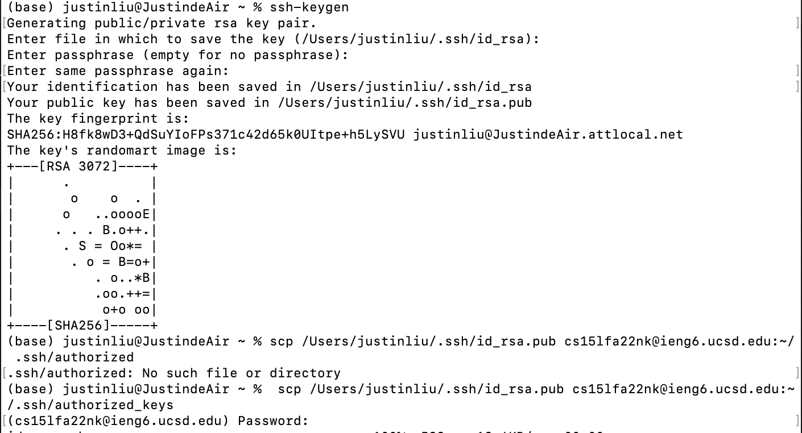
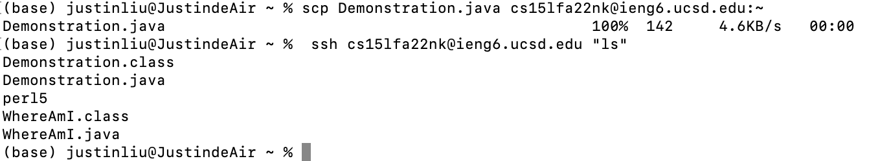

# Lab Report Week 1
## How to access UCSD SSH
> Step 1: Installing VScode
* Go to [this website](https://code.visualstudio.com/download) to download VScode.
Select the version you want to download, and follow the corresponding instruction to install it.



> Step 2: Remotely Connecting to UCSD SSH
* If you're using windows, first download OpenSSH [here](https://docs.microsoft.com/en-us/windows-server/administration/openssh/openssh_install_firstuse). 
* Then, in your local command line, connect to UCSD SSH using the code below:

```
$ ssh cs15lfa22zz@ieng6.ucsd.edu
```
***Remember to switch cs15lfa22zz to your personal CSE15L user name!***

* The following should show up in your terminal, type in ***yes***, and input your password.

```
⤇ ssh cs15lfa22zz@ieng6.ucsd.edu
The authenticity of host 'ieng6.ucsd.edu (128.54.70.227)' can't be established.
RSA key fingerprint is SHA256:ksruYwhnYH+sySHnHAtLUHngrPEyZTDl/1x99wUQcec.
Are you sure you want to continue connecting (yes/no/[fingerprint])?
```
* You should see the following on your command line:

```
Last login: Sun Jan  2 14:03:05 2022 from 107-217-10-235.lightspeed.sndgca.sbcglobal.net
quota: No filesystem specified.
Hello cs15lfa22zz, you are currently logged into ieng6-203.ucsd.edu

You are using 0% CPU on this system

Cluster Status 
Hostname     Time    #Users  Load  Averages  
ieng6-201   23:25:01   0  0.08,  0.17,  0.11
ieng6-202   23:25:01   1  0.09,  0.15,  0.11
ieng6-203   23:25:01   1  0.08,  0.15,  0.11

Sun Jan 02, 2022 11:28pm - Prepping cs15lfa22
```


> Step 3: Try Some Commands
* Now you can try several commands in the SSH such as:
```
cd
ls
mkdir
cd `
cd .. 
ls -lat
ls -a
cp
cat
```
* Such demands have same functions as on your local command line but instead you are controlling the computer in UCSD CSE basement.


> Step 4: Move files over using scp command

* Now, if you wan to upload a file from your personal computer to the SSH, you can do it with the scp command.

* After you move the file(s) over, you can use javac to compile and run it just like on your local command line.


> Step 5: Setting the SSH Key

* If you are going to log into SSH many times in the future, inputing a password everytime may be annoying. However, if you do the following, you do not have to input your password everytime you log in.


* After executing the above commands, the login window will be the same except the password line will not appear.

> Step 6: Optimizing Remote Running
* You can make the utilization of SSH even easier. By using the commands below, you can run commands on the SSH without logging in. 
