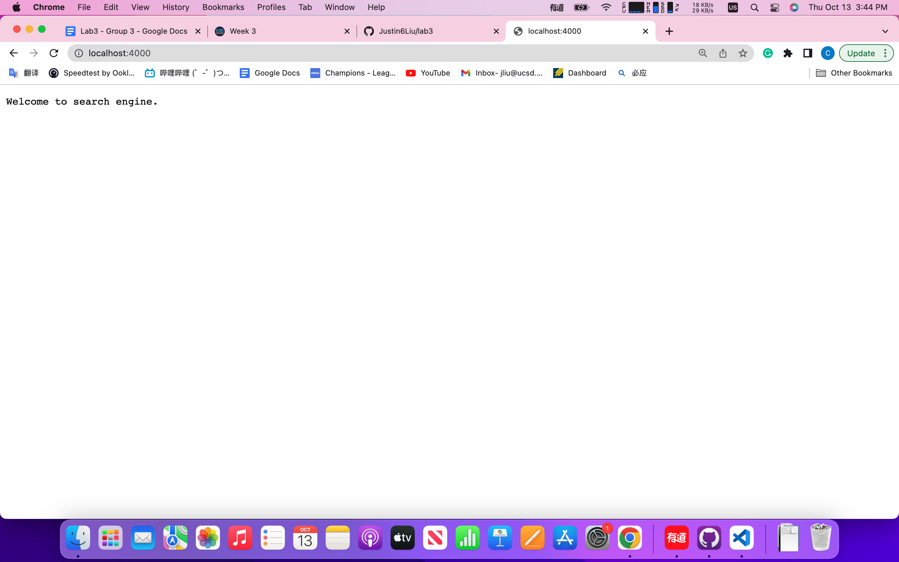
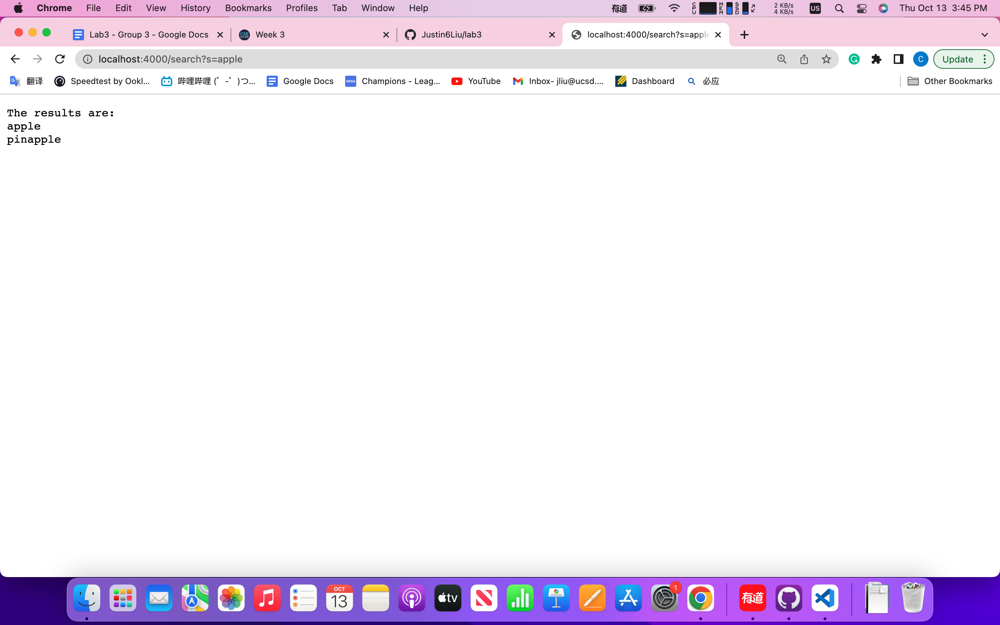

# Lab Report Week 3
## My Simplest Search Engine from Week 2
> My codes for simplest search engine
```
import java.io.IOException;
import java.io.OutputStream;
import java.net.URI;
import java.util.ArrayList;


class SearchEngineHandler implements URLHandler {
    
    ArrayList<String> listOfStrings = new ArrayList<>();

    public String handleRequest(URI url) {
        if (url.getPath().equals("/")) {
            return "Welcome to search engine.";
        } else {
            System.out.println("Path: " + url.getPath());
            if (url.getPath().contains("/add")) {
                String[] parameters = url.getQuery().split("=");
                if (true) {
                    listOfStrings.add(parameters[1]);
                    return String.format("%s has been added to the list.", parameters[1]);
                }
            } else if (url.getPath().contains("search")) {
                String[] parameters = url.getQuery().split("=");
                String outputInString = "No results found";
                if (true) {
                    String toLookFor = parameters[1];
                    ArrayList<String> output = new ArrayList<>();
                    for (int i = 0; i < (listOfStrings.size()); i++){
                        if (listOfStrings.get(i).contains(toLookFor)){
                            output.add(listOfStrings.get(i));
                        }

                    }
                    if (output.size() != 0) {
                        outputInString = "The results are: \n";
                        for (int j=0; j<output.size(); j++) {
                            outputInString += output.get(j);
                            outputInString += "\n";
                        }
                    }
                    return outputInString;
                }
            }
            return "404 Not Found!";
        }
    }
}
public class SearchEngine {
    public static void main(String[] args) throws IOException {
        if(args.length == 0){
            System.out.println("Missing port number! Try any number between 1024 to 49151");
            return;
        }

        int port = Integer.parseInt(args[0]);

        Server.start(port, new SearchEngineHandler());
    }
}

```

> Here are some screenshots of how my search engine functioned:


* In this first image, the method of ***Server.start(port, searchEngineHandler)*** has been called since it's the first method used to even start the server. In this case, the port I used was 4000 so the url was http://localhost:4000. If we changed this value we inputed to some other numbers between 1024 to 49151, we would have a different url with the nunmber 4000 be replaced by the input number we use. If we do not input any number when starting the program, the program would print a message and ask for a port number.

* Then, the method of ***handleRequest()*** has been called to process the URL we inputed, in which in this case I didn't add anything else to the root URL so the search engine returns a default page with a welcome message.



* In this second image, we added the string ***add?s=apple*** to the root url, which triggers the if else statement inside the ***handleRequest()*** method. Then, the method ***getPath()*** was triggered in which the method takes the url path and campare it with what we set in the if else statement. In this case the method detected the string ***add*** in the path so the method ***of getQuery()*** was called, in which ***s=apple***, which is the content of the query, has been extracted and examined. Finally, it passes the if else statement and added the word ***apple*** to the dictionary.

* This time, if we changed the input, which is the content of the query (since changing the path will lead to other functions running in which we'll talk about along with next image), we can add other words into the dictionary. Such as adding a banana and a pineapple into the dictionary, which I actually did without showing the images.


* In this last image, we added the string ***search?s=apple*** to the root url, which triggers the if else state insiede ***handleRequest()***, and ***getPath()***. Then, since it detected the keyword ***search***, the if else inside ***handleRequest*** will know that we're trying to print out all the matches in the dictionary. Since we added apple, banana, and pineapple into the dictionary, the output for ***search?s=apple*** will be apple and pineapple.

* If we changed the content of the query to other words such as banana, or only a part of the word like "nana", the output would be banana since that's the only word in the dictionary that matches the keyword.



## Debugging for Array and List Methods
> For array method ***reversed()*** 

* The failure inducing input (code) is shown below:

```
@Test
  public void testFailReversed(){
    int[] input1 = {1,2,3};
    //false output should be {0,0,0}
    assertArrayEquals(new int[]{3,2,1}, ArrayExamples.reversed(input1));
  }
```

* The symptom was {0,0,0}

* The bug for reversed is that it will return an array of 0, since it used the new array created as the target for reversal, thus it should be fixed by assigning value to newArray instead of array.

* Connection between symptom and bug: As stated in the previous part, the bug causes the symptom of returning a bunch of zeros depending on the size of the input, which are the default value for ***new int[]***. The reason is because the bug copies from the new empty array to the original input array instead of the opposite way, causing the output to be all zeros.

>For list method ***filter()***

*The failure inducing input (code) is shown below:

```
@Test
    public void testForFilter(){
        List<String> input1 = new ArrayList<>();
        input1.add("a");
        input1.add("b");
        input1.add("c");
        // false output should be c,b,a
        assertEquals(input1, ListExamples.filter(input1, new AlwaysCorrectChecker()));
    }
```

* The symptom was {c,b,a}, which should be {a,b,c} since teh checker I used should always return true thus returning the input in same order.

* The bug was that the methods always add the correct string at index 0, which is the front of the output. It can be fixed by letting it add to the end of the list by noting giving the command ***add()*** an index.

* Connection between symptom and bug: As staeted earlier, since the method use ***add(0,correctoutput)*** for all the correctoutput that passed the exmination of the checker, it always addes the correctoutput to the fron of the list, causing the symptom of reversing the order of the correct outputs.
