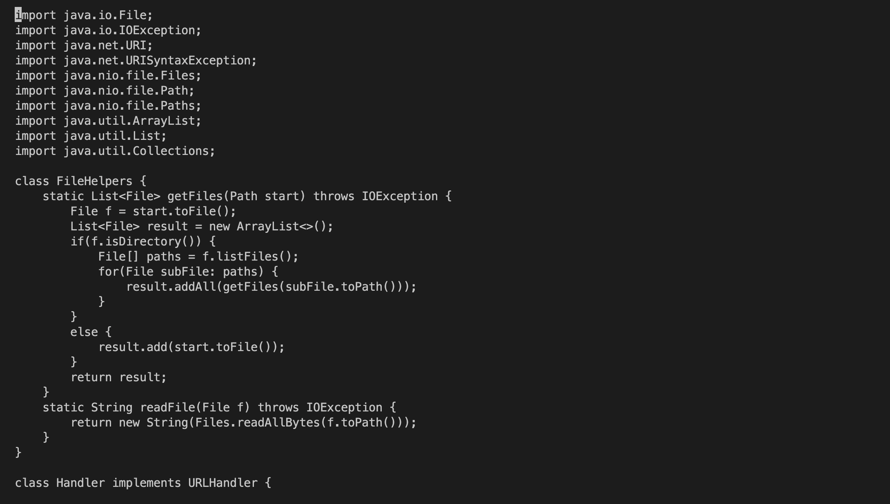
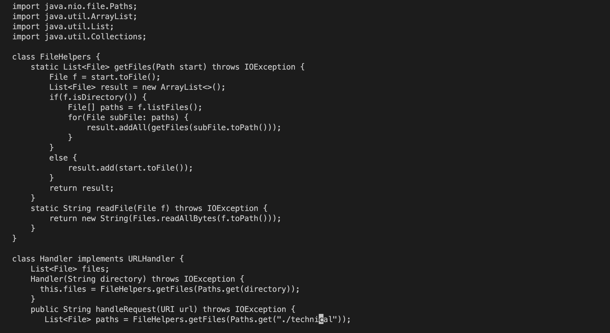
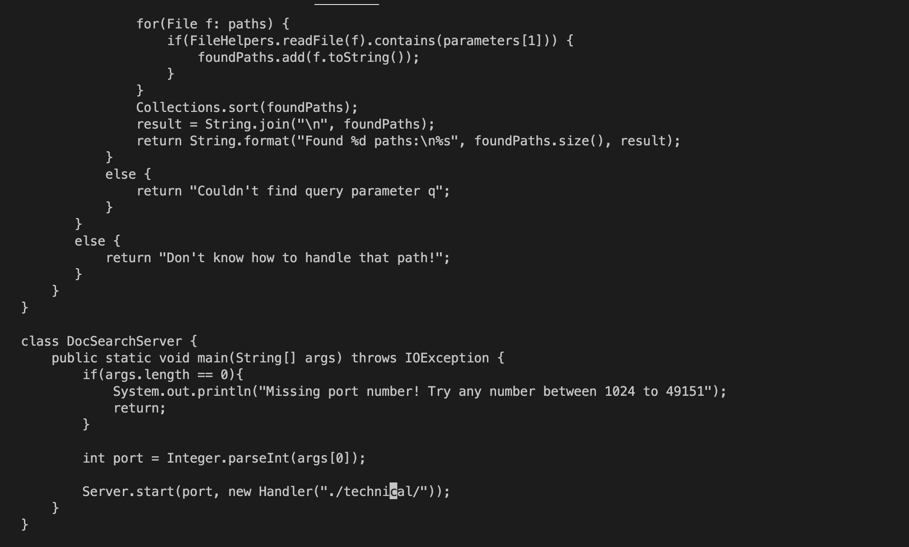
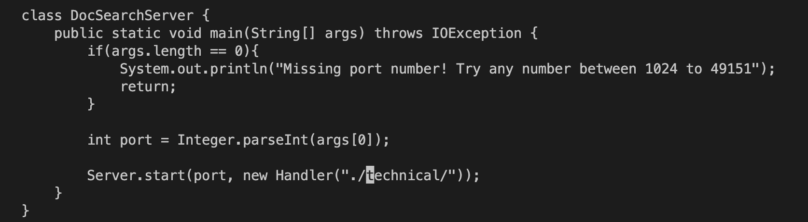
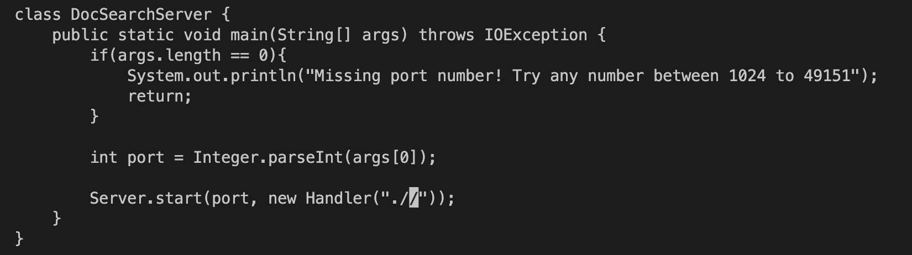
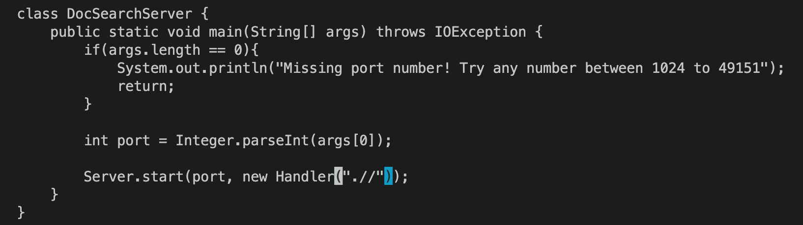
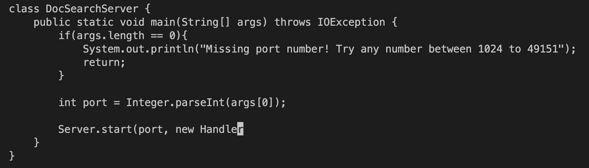
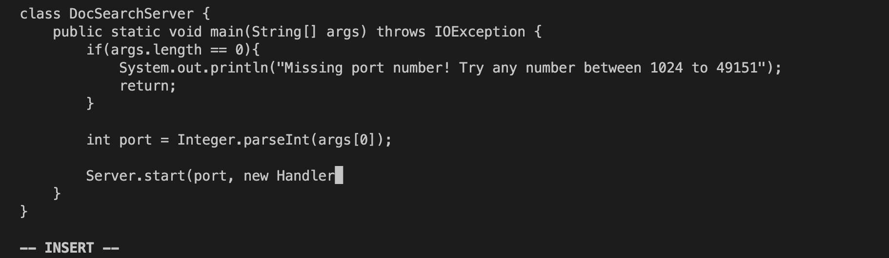
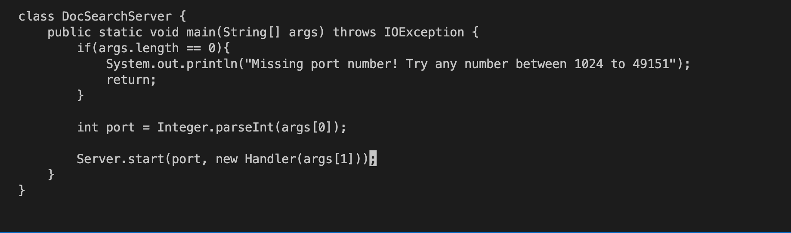

# Lab Report 5 Week 7
## Part 1
> Changing the main method to take a command-line argument
* keys used: `/cal`,`<Enter>`, `n`, `b`,`dw`,`b`,`dw`,`a`,`(args[1]);`, `<esc>`, `:wq`,`<Enter>`
* total keys used: 28

> Detailed Steps:
* First, after entering vim mode, the screen looks like this

* `/cal`,`<Enter>`
* Cursor jump to first "technical"

*`n`
* Cursor jump to second "technical"

*`b`
* Cursor jump to beginning of "technical"

* `dw`
* Delete the entire word

* `b`
* Cursor jump to begining of current word

* `dw`
* Delete the entire word

* `a`
* Starts inserting at the end

* `(args[1]);`
* Insert the above string

* Then, simply use `<esc>`, `:wq`,`<Enter>` to save and exit the vim.

## Part 2
* Editing offline in VSCode first then use scp to sent it to the remote server cost me about a minute.
* Editing directly in the remote server cost me about a minute as well.
> Which of these two styles would you prefer using if you had to work on a program that you were running remotely, and why?

* Answer: In practice, if ther are only small changes I have to make to the documents in the remote server, I may prefer do it through vim on the remote server since it's more convenienet. If I have to write an entire program or make some huge modifications to the program(s), I will prefer do it offline wiht VSCode since it's helps me make fewer mistakes while programming.

> What about the project or task might factor into your decision one way or another? (If nothing would affect your decision, say so and why!)

* Answer: The first and most important factor is how big of a change I need to make to the document(s) in the server. Then, if it's a big change overall, but actually many small changes in many different files, this may affect my choice and I would chosse to do it on vim. Moreover, the complexity of the file structure on the remote server may be another factor. For example, if the file I want to modify is hide within many layers of directories, it will be hard for me to scp it to the correct place from my coputer, so I'd rather edit it directly through vim.