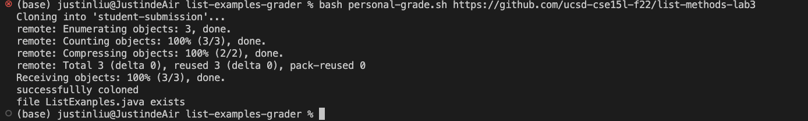
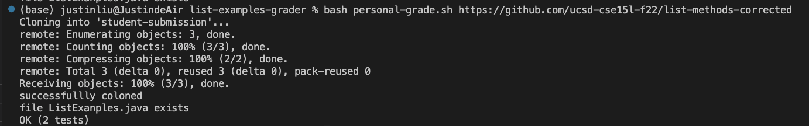
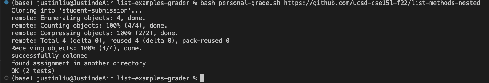

# Lab Report 6
## My Auto Grader
```
set -e

rm -rf student-submission
git clone $1 student-submission
echo "successfullly coloned" 
cp TestListExamples.java student-submission/
cp -r lib/ student-submission/lib
cd student-submission
APATH="ListExamples.java"

if [[ -f $APATH ]]
then
  echo "file ListExanples.java exists"
  javac -cp .:lib/hamcrest-core-1.3.jar:lib/junit-4.13.2.jar *.java 2> stderr.txt
  java -cp .:lib/hamcrest-core-1.3.jar:lib/junit-4.13.2.jar org.junit.runner.JUnitCore TestListExamples > stdout.txt 2> stderr.txt
  grep "2 tests" stdout.txt
  exit
fi

find * > find-result.txt
grep "/ListExamples.java" find-result.txt > grep-result.txt

if [[ $? -eq 0 ]]
then 
  echo "found assignment in another directory"
  LOCATION=$(cat grep-result.txt)

  cp $LOCATION /Users/justinliu/Documents/GitHub/list-examples-grader/student-submission
  javac -cp .:lib/hamcrest-core-1.3.jar:lib/junit-4.13.2.jar *.java 2> stderr.txt
  java -cp .:lib/hamcrest-core-1.3.jar:lib/junit-4.13.2.jar org.junit.runner.JUnitCore TestListExamples > stdout.txt 2> stderr.txt
  grep "2 tests" stdout.txt
  exit
fi

echo "file ListExanples.java not exists"

```

* result for https://github.com/ucsd-cse15l-f22/list-methods-lab3

As we can see, the grader did not print out OK since this program contains an infinite loop.

* result for https://github.com/ucsd-cse15l-f22/list-methods-corrected

This time the grader printed Ok, which means the program passed the test.

* result for https://github.com/ucsd-cse15l-f22/list-methods-nested

This is the program that's hidden in a folder called PA1, and my grader successfully run the test as well and printed out OK.

> Tracing the grader

> Here we're going to trace the third example stated above

```
set -e                                              # exit code 0, no stdout stderr

rm -rf student-submission                           # exit code 0, no stdout stderr
git clone $1 student-submission                     # exit code 0, no stderr
                                                    # stdout:
                                                    #Cloning into 'student-submission'...
                                                    #remote: Enumerating objects: 4, done.
                                                    #remote: Counting objects: 100% (4/4), done.
                                                    #remote: Compressing objects: 100% (2/2), done.
                                                    #remote: Total 4 (delta 0), reused 4 (delta 0), pack-reused 0
                                                    #Receiving objects: 100% (4/4), done.
```


```
echo "successfullly coloned"                        # exit code 0, no stderr, stdout: "successfullly coloned" 
cp TestListExamples.java student-submission/        # exit code 0, no stdout stderr
cp -r lib/ student-submission/lib                   # exit code 0, no stdout stderr
cd student-submission                               # exit code 0, no stdout stderr
APATH="ListExamples.java"                           # exit code 0, no stdout stderr
```


```
if [[ -f $APATH ]]                                  # if condition was false, since the file "ListExamples.java" was 
                                                    # hidden inside another folder called PA1, and the rest of the 
                                                    # if statement would not run
then
  echo "file ListExanples.java exists"
  javac -cp .:lib/hamcrest-core-1.3.jar:lib/junit-4.13.2.jar *.java 2> stderr.txt
  java -cp .:lib/hamcrest-core-1.3.jar:lib/junit-4.13.2.jar org.junit.runner.JUnitCore TestListExamples > stdout.txt 2> stderr.txt
  grep "2 tests" stdout.txt
  exit
fi
```
`find * > find-result.txt`
exit code 0, no stderr, stdout: 

TestListExamples.java

lib

lib/junit-4.13.2.jar

lib/hamcrest-core-1.3.jar

pa1

pa1/ListExamples.java


`grep "/ListExamples.java" find-result.txt > grep-result.txt`

exit code 0, no stderr, stdout: 

pa1/ListExamples.java

```
if [[ $? -eq 0 ]]                                      # the if condition was true, since we found "pa1/ListExamples.
                                                       # java" inside the "grep-result.txt"
then 
  echo "found assignment in another directory"         # exit code 0, no stderr, stdout: "found assignment in 
                                                       # another directory" 
  LOCATION=$(cat grep-result.txt)                      # exit code 0, no stdout stderr

  cp $LOCATION /Users/justinliu/Documents/GitHub/list-examples-grader/student-submission
                                                       # exit code 0, no stdout stderr
  javac -cp .:lib/hamcrest-core-1.3.jar:lib/junit-4.13.2.jar *.java 2> stderr.txt
                                                       # exit code 0, no stdout stderr
  java -cp .:lib/hamcrest-core-1.3.jar:lib/junit-4.13.2.jar org.junit.runner.JUnitCore TestListExamples > stdout.txt 2> stderr.txt
                                                       # exit code 0, no stderr, stdout: 
                                                       # JUnit version 4.13.2
                                                       # ..
                                                       # Time: 0.011
                                                       # OK (2 tests)


  grep "2 tests" stdout.txt                            # exit code 0, no stderr, stdout: OK (2 tests)
  exit                                                 # exit code 0, no stderr stdout
fi

echo "file ListExanples.java not exists"               # this line did not run

```